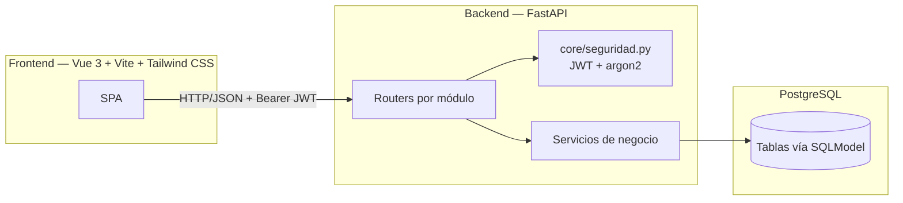

# 4. Arquitectura del proyecto

## Arquitectura definida

La aplicación separa completamente el cliente (SPA web) del servidor (API
REST), comunicándose por HTTP/JSON. Se mantienen tres capas conceptuales,
cada una en un proyecto distinto:

### Capa de presentación — SPA en Vue 3

Se implementa con **Vue 3** (Composition API), **Vite** como bundler y
**Tailwind CSS** para estilos. La SPA consume la API REST del backend y se
adapta según el `tipoContribuyente` del contribuyente activo (oculta las
vistas de inventario si es `ASALARIADO`). El token JWT se guarda en memoria
del cliente (no en `localStorage`, para reducir superficie de ataque ante
XSS) y se adjunta como header `Authorization: Bearer <token>` en cada
petición.

### Capa de lógica de negocio — API REST

Se implementa con **FastAPI** (Python), expuesta como API REST pura (sin
HTML embebido). Se organiza en **routers** independientes por módulo:
`contadores`, `contribuyentes`, `exogena`, `parametros`, `conciliacion`,
`cartera`, `inventario`, `movimientos` y `reportes`, cada uno con su lógica
de negocio en un módulo `servicios.py`. Las rutas son síncronas (`def`, no
`async def`) por decisión explícita: FastAPI no exige async para
beneficiarse de tipado y documentación automática, y evita introducir
manejo de sesiones asíncronas como una fuente adicional de errores en un
proyecto con fecha de entrega fija.

### Capa de datos

Se implementa con **SQLModel** sobre **PostgreSQL**. SQLModel unifica en
una sola clase el modelo de tabla (equivalente a un modelo de SQLAlchemy) y
el esquema de validación de entrada/salida (equivalente a un esquema de
Pydantic), reduciendo la duplicación de tener `models.py` y `schemas.py`
por separado. Internamente sigue corriendo sobre SQLAlchemy, por lo que no
implica reescribir el conocimiento de SQL/ORM ya adquirido, solo un patrón
de escritura distinto.

Dos tablas de esta capa no pertenecen a ningún contribuyente: `ConceptoDian`
(catálogo de referencia, módulo `exogena`) y `UmbralDeclaracion` (topes de
declaración por año gravable, módulo `parametros`). Ambas se tratan como
datos de configuración administrables, no como datos transaccionales de un
contribuyente.

## Stack tecnológico definitivo

| Componente | Tecnología |
|---|---|
| Frontend (SPA) | Vue 3 (Composition API) |
| Bundler / dev server | Vite |
| Estilos | Tailwind CSS |
| Cliente HTTP (frontend) | Fetch API o Axios |
| Backend / API | FastAPI (Python 3), rutas síncronas |
| ORM + validación | SQLModel |
| Base de datos | PostgreSQL |
| Autenticación | JWT (OAuth2PasswordBearer) |
| Hash de contraseñas | `passlib` con `argon2` |
| Parseo y cruce de información exógena | `pandas` |
| Exportación de reportes | `openpyxl` (Excel) y `reportlab` (PDF) |
| Testing backend | `pytest` + `TestClient` de FastAPI |
| Control de versiones | Git + GitHub |

## Por qué este stack (y qué se descartó a propósito)

Este proyecto comparte curso con otro desarrollado en Flask + SQLAlchemy +
Jinja2 + Bootstrap + SQLite. Para evitar repetir exactamente las mismas
herramientas sin ganar nada nuevo, se tomaron decisiones deliberadamente
distintas donde el cambio aporta aprendizaje real, y se mantuvieron
decisiones donde cambiar solo por variar no tendría sustento técnico:

- **SPA (Vue) en vez de renderizado en servidor (Jinja2)**: es el cambio de
  paradigma más significativo — cliente y servidor completamente
  desacoplados, comunicándose solo por API. Tiene un costo real: hay que
  configurar CORS, correr dos procesos en desarrollo (`vite dev` +
  `uvicorn`) y coordinar el build del frontend para producción. Se asume
  ese costo porque es precisamente lo que se busca aprender.
- **SQLModel en vez de SQLAlchemy puro**: cambia el día a día de escribir
  modelos (una sola clase en vez de modelo + esquema separados), pero sigue
  corriendo sobre SQLAlchemy — no es una ruptura total, es una capa de
  ergonomía distinta.
- **JWT + argon2 en vez de sesión de servidor + bcrypt**: mecanismo de
  autenticación sin estado (en vez de sesión), y un algoritmo de hash más
  reciente. Es una elección relevante para quien tiene interés en
  ciberseguridad.
- **pandas en vez de solo `openpyxl` para el análisis**: no es una decisión
  de "variar por variar" — conciliar renglones de exógena contra lo
  declarado es un problema de cruce de datasets, y `pandas` está hecho para
  eso. `openpyxl` sigue usándose, pero solo para *escribir* los reportes de
  salida, que es su rol natural.
- **`pytest` se mantiene sin cambios**: es el estándar de pruebas en
  Python, no una herramienta específica de Flask. Cambiarlo solo por variar
  no tendría justificación técnica; lo que cambia es qué se prueba
  (endpoints de FastAPI con `TestClient`, no rutas de Flask).
- **FastAPI sin `async`**: se consideró usar rutas y sesión de base de
  datos completamente asíncronas (con `asyncpg`), que hubiera sido "más
  distinto" todavía. Se descartó para esta primera versión porque Python
  async tiene una curva de aprendizaje propia (manejo del *event loop*,
  ciclo de vida de la sesión, errores por `await` faltante) que no conviene
  asumir a la vez que se aprende el resto del stack, con una fecha de
  entrega fija. Queda como mejora incremental razonable si sobra tiempo al
  final del semestre.

## Decisión: el contribuyente no tiene su propio inicio de sesión

Se decidió que solo el `Contador` se autentica en la aplicación; el
`Contribuyente` es un registro que el contador crea y gestiona, sin cuenta
propia. Esto es coherente con cómo trabaja un contador en la práctica
(recibe documentos y datos de su cliente por fuera de la aplicación, y es
él quien los carga) y evita construir dos flujos de autenticación y
autorización en paralelo. Si más adelante se requiere que el contribuyente
consulte sus propios reportes de forma directa, es una extensión sobre este
modelo (agregar un segundo tipo de usuario con permisos de solo lectura
sobre su propio contribuyente), no un cambio de arquitectura.

## Comunicación entre capas

1. La SPA hace peticiones HTTP (GET/POST/PUT/DELETE) a los endpoints del
   backend, incluyendo el token JWT en el header `Authorization`.
2. FastAPI valida el token (dependencia `get_contador_actual`), valida los
   datos de entrada (SQLModel/Pydantic), ejecuta la lógica de negocio
   correspondiente en `servicios.py` y consulta/actualiza PostgreSQL.
3. El backend responde en formato JSON; la SPA actualiza la interfaz.
4. Para los reportes (Excel/PDF), el backend genera el archivo y lo expone
   como descarga; la SPA dispara la descarga desde el navegador.
5. Para la importación de exógena, la SPA envía el archivo como
   `multipart/form-data`; el backend lo procesa con `pandas` de forma
   síncrona y responde con el resultado de la importación (filas
   procesadas, topes detectados, filas con error).

## Principios de diseño

- **Separación total cliente-servidor**: el frontend no contiene lógica de
  negocio ni acceso directo a la base de datos; todo pasa por la API.
- **Aislamiento por contador**: ningún endpoint devuelve datos de
  contribuyentes que no pertenezcan al contador autenticado — se valida en
  cada consulta, no solo en la pantalla.
- **Organización por router en el backend**: cada módulo de negocio es un
  router independiente, siguiendo la estructura de carpetas definida en
  [02. Estructura del proyecto](02-estructura-proyecto.md).
- **Trazabilidad**: todo movimiento de inventario queda vinculado a su
  documento soporte y a su periodo fiscal; todo `RegistroExogena` queda
  vinculado al archivo del que se originó.
- **La conciliación no altera datos**: el motor de conciliación (Proceso 6
  de [03. Lógica del proyecto](03-logica-proyecto.md)) es de solo lectura
  sobre lo ya registrado — nunca corrige automáticamente un valor
  declarado.
- **Lo que la app no puede verificar, lo dice explícitamente**: tanto la
  obligación de declarar (Proceso 5) como el borrador de renglones (Proceso
  7) se presentan como apoyo, nunca como un resultado definitivo que
  reemplace el criterio profesional del contador.
- **Los datos de configuración no son constantes en el código**: los
  umbrales de declaración (`UmbralDeclaracion`) cambian cada año por
  resolución de la DIAN y se administran como datos, no como valores fijos
  en el backend.
