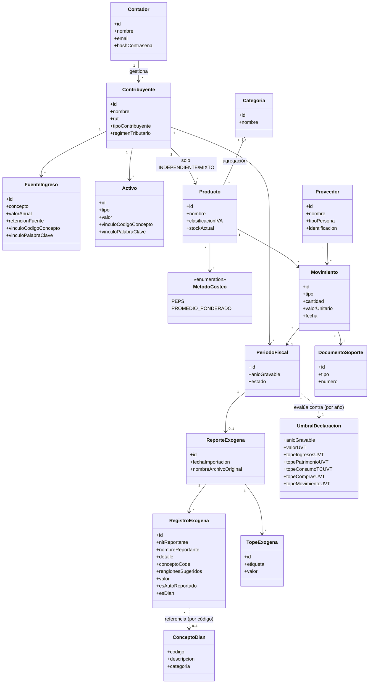

# 7. Diagrama de clases

El modelo tiene cuatro niveles: uno de cuenta (`Contador`), uno de
configuración sin dueño (`UmbralDeclaracion`, `ConceptoDian`), uno general
por contribuyente (`Contribuyente`, `FuenteIngreso`, `Activo`), y uno
específico —exógena e inventario— que solo aplica según el caso.

## Clases — cuenta y nivel general

| Clase | Responsabilidad |
|---|---|
| `Contador` | Representa al profesional que usa la aplicación; se autentica y gestiona su cartera de contribuyentes. |
| `Contribuyente` | Representa a un cliente del contador; define su tipo (asalariado, independiente o mixto) y su régimen tributario. Pertenece a un único `Contador`. |
| `FuenteIngreso` | Registra cada ingreso del contribuyente, con su retención en la fuente y un vínculo DIAN opcional (código de concepto o palabra clave) usado por la conciliación. |
| `Activo` | Registra cada bien que compone el patrimonio del contribuyente, con el mismo vínculo DIAN opcional que `FuenteIngreso`. |
| `PeriodoFiscal` | Agrupa la información (ingresos, activos, movimientos, exógena) de un contribuyente correspondiente a un año gravable. |

## Clases — módulo de información exógena

| Clase | Responsabilidad |
|---|---|
| `ReporteExogena` | Representa la importación del archivo Excel de la DIAN para un contribuyente y un periodo fiscal específicos. |
| `RegistroExogena` | Cada fila normalizada del archivo importado: tercero reportante, concepto, renglón(es) sugerido(s) y valor. Marca si es autoreportada o reportada por la propia DIAN. |
| `TopeExogena` | Cada una de las cinco filas de "Topes" del archivo (Ingresos, Patrimonio, Consumo TC, Compras, Movimiento) — se guardan aparte de `RegistroExogena` porque no son un registro de tercero, y se usan solo como referencia informativa y como entrada de `UmbralDeclaracion`. |
| `ConceptoDian` | Catálogo de referencia (código → descripción/categoría) construido con los códigos que se van identificando en uso; sugiere vínculos automáticos al registrar `Activo`/`FuenteIngreso`. |

> El resultado de la conciliación (coincide / discrepancia / no declarado /
> no reportado por tercero) y el borrador de renglones son **valores
> calculados** por los módulos de conciliación en el momento de la
> consulta — no se persisten como entidades propias, para evitar que
> queden desactualizados si se corrige un dato después de conciliar. Ver
> [03. Lógica del proyecto](03-logica-proyecto.md), Procesos 6 y 7.

## Clases — módulo de parámetros

| Clase | Responsabilidad |
|---|---|
| `UmbralDeclaracion` | Tabla de configuración, un registro por año gravable: valor de la UVT y los cinco topes que determinan la obligación de declarar. No pertenece a ningún contribuyente ni contador — es un dato administrado por separado, porque cambia una vez al año por resolución de la DIAN. |

> El estado de "obligado a declarar" de un contribuyente tampoco se
> persiste: se calcula comparando los `TopeExogena` de su
> `ReporteExogena` más reciente contra el `UmbralDeclaracion` del año
> gravable correspondiente (Proceso 5).

## Clases — módulo de inventario (solo negocios)

| Clase | Responsabilidad |
|---|---|
| `Categoria` | Agrupa los productos según su naturaleza (ej. materia prima, producto terminado). |
| `Producto` | Unidad central del inventario; pertenece a un `Contribuyente` y define su clasificación fiscal y método de costeo aplicable. |
| `MetodoCosteo` | Enumeración con los métodos aceptados fiscalmente (PEPS, promedio ponderado). |
| `Proveedor` | Tercero del cual se originan los movimientos de compra. |
| `Movimiento` | Registra cada entrada o salida de inventario, con cantidad, valor y fecha. |
| `DocumentoSoporte` | Representa la factura, acta o nota que respalda un movimiento, para efectos de trazabilidad y auditoría. |

## Relaciones principales

- Un `Contador` tiene muchos `Contribuyente` (1 — \*); ningún contribuyente
  pertenece a más de un contador en este alcance.
- Un `Contribuyente` tiene muchos `FuenteIngreso`, `Activo` y
  `PeriodoFiscal` (1 — \*); esto aplica a todos los contribuyentes.
- Un `Contribuyente` tiene muchos `Producto` (1 — \*) **solo** si su
  `tipoContribuyente` es independiente o mixto.
- Un `PeriodoFiscal` tiene, a lo sumo, un `ReporteExogena` (0..1 — 1); un
  `ReporteExogena` tiene muchos `RegistroExogena` y muchos `TopeExogena`
  (1 — \*).
- Un `RegistroExogena` puede referenciar un `ConceptoDian` por su código
  (relación de consulta, no de propiedad — el catálogo existe
  independientemente de cualquier registro concreto).
- Un `PeriodoFiscal` se evalúa contra el `UmbralDeclaracion` del año
  gravable que le corresponde (relación de consulta al calcular la
  obligación de declarar, no una relación almacenada).
- Una `Categoria` puede agrupar muchos `Producto` (**agregación**, 1 —
  \*): si se elimina o reclasifica una categoría, los productos no dejan de
  existir.
- Cada `Producto` usa un `MetodoCosteo` (\* — 1) y tiene muchos
  `Movimiento` (1 — \*).
- Un `Proveedor` puede originar muchos `Movimiento` de compra (1 — \*).
- Cada `Movimiento` está respaldado por un `DocumentoSoporte` (\* — 1) y
  pertenece a un `PeriodoFiscal` (\* — 1).

## Notas del modelo

- `Movimiento.valorTotal` es un **atributo derivado**
  (`cantidad × valorUnitario`); no se almacena de forma independiente.
- El aislamiento por contador se aplica a nivel de consulta: toda consulta
  sobre `Contribuyente` (y todo lo que cuelga de él) filtra por
  `contador_id` del token JWT, no solo en la interfaz.
- `UmbralDeclaracion` y `ConceptoDian` son las dos únicas tablas del modelo
  sin relación de propiedad hacia `Contador` o `Contribuyente` — son datos
  de referencia compartidos por toda la aplicación.
