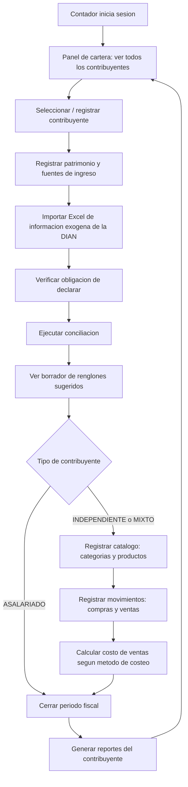

# 8. Diagrama de flujo

El flujo comienza con el contador viendo su cartera y se ramifica según el
tipo de contribuyente que esté gestionando en un momento dado.

## Paso común a todos los contribuyentes

1. **Iniciar sesión como contador**: solo el contador se autentica; el
   contribuyente es un registro que el contador gestiona.
2. **Panel de cartera**: el contador ve todos sus contribuyentes a la vez,
   con su estado de obligación de declarar y sus alertas de conciliación
   pendientes, para decidir por cuál empezar.
3. **Seleccionar o registrar contribuyente**: si es nuevo, el contador
   indica si es asalariado, independiente o mixto, y su régimen tributario.
4. **Registrar patrimonio general**: se cargan los `Activo` (cuentas,
   vehículo, inmueble, inversiones) y las `FuenteIngreso` (salario,
   honorarios, arriendos) del contribuyente, opcionalmente con su vínculo
   DIAN.
5. **Importar información exógena**: el contador sube el Excel descargado
   previamente del portal de la DIAN para ese contribuyente y año gravable.
6. **Verificar obligación de declarar**: con los topes ya extraídos, la
   aplicación indica si el contribuyente queda obligado a declarar ese año.
7. **Ejecutar conciliación**: la aplicación cruza lo importado contra lo
   registrado y muestra el resultado por concepto.
8. **Ver borrador de renglones**: la aplicación agrupa los valores de la
   exógena por renglón sugerido del formulario, como punto de partida para
   la declaración.

## Ruta A — Contribuyente asalariado (sin negocio)

9. Con patrimonio, ingresos, obligación, conciliación y borrador de
   renglones ya resueltos, el contador **cierra el periodo fiscal** del
   contribuyente.
10. La aplicación genera el **reporte consolidado** como apoyo para
    diligenciar la declaración, y el contador vuelve al panel de cartera
    para continuar con el siguiente contribuyente.

## Ruta B — Contribuyente con negocio (independiente o mixto)

9. **Registro de catálogo**: se cargan las categorías y productos, con su
   clasificación fiscal (gravado, exento, excluido).
10. **Registro de movimientos**: cada compra o venta se registra como un
    movimiento, adjuntando el documento soporte correspondiente.
11. **Cálculo automático**: la aplicación calcula el saldo de inventario y
    el costo de ventas según el método de costeo configurado.
12. **Cierre de periodo fiscal**: consolida los movimientos del periodo y
    suma el valor del inventario al patrimonio del contribuyente.
13. **Generación de reportes**: kardex, saldo final de inventario, resumen
    de patrimonio e ingresos, obligación de declarar, reporte de
    conciliación y borrador de renglones — y el contador vuelve al panel
    de cartera.

## Convergencia

En ambas rutas, el resultado final es el mismo: un conjunto de reportes
—incluidos el de obligación de declarar, el de conciliación y el borrador
de renglones— que el contador entrega al contribuyente como respaldo al
momento de presentar la declaración de renta ante la DIAN, y una vuelta al
panel de cartera para atender al siguiente cliente.
